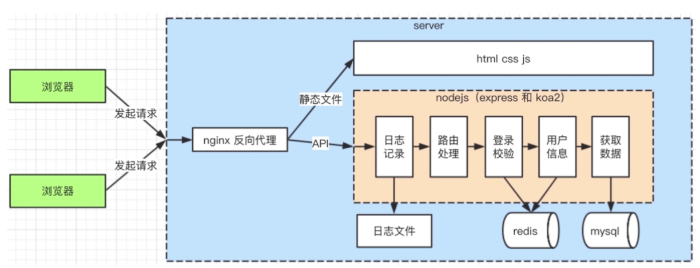

# node_blog
nodejs个人博客，使用：Node.js+Express+Koa

### 模块
 - API
 - 数据存储
 - 登陆
 - 日志
 - 安全

### 技术
 - http
 - stream
 - session
 - mysql
 - redis
 - nginx
 - pm2

### 架构

### nvm
nvm是nodejs版本管理工具，可切换多个Node版本
 - mac
   - brew install nvm
 - windows
   - github搜索nvm-windows

使用nvm
 - `nvm list` 查看当前所有node版本
 - `nvm install v10.13.0` 安装指定的版本
 - `nvm use --delete-prefix 10.13.0` 切换到指定版本

### ECMAScript，JavaScript，Node.js区别
 - ECMAScript
   - 定义语法规范，js和node都必须遵循
   - 不能操作DOM，不能发送Ajax请求，不操作事件，不处理HTTP请求
 - JavaScript
   - 使用ECMAScript语法规范
   - 加Web API
     - DOM操作，Ajax等
 - Node.js
   - 使用ECMAScript语法规范
   - 加nodejs API
     - http请求，文件操作等

### Server端与前端开发的区别
 - 服务稳定性
   - server端可能遭受各种恶意攻击和误操作
   - 单个客户端可以挂掉，但服务端不能
 - 考虑内存、CPU（优化，扩展）
   - 客户端独占一个浏览器，内存和CPU都不是问题
   - server端要承载很多请求，CPU和内存是稀缺资源
 - 日志记录
   - server端需要记录、分析日志，而前端最多是发起日志
 - 安全
   - 防备各种恶意攻击
   - 如：越权操作，数据库攻击
 - 集群和服务拆分
   - 如何通过扩展机器和服务拆分来承载大流量